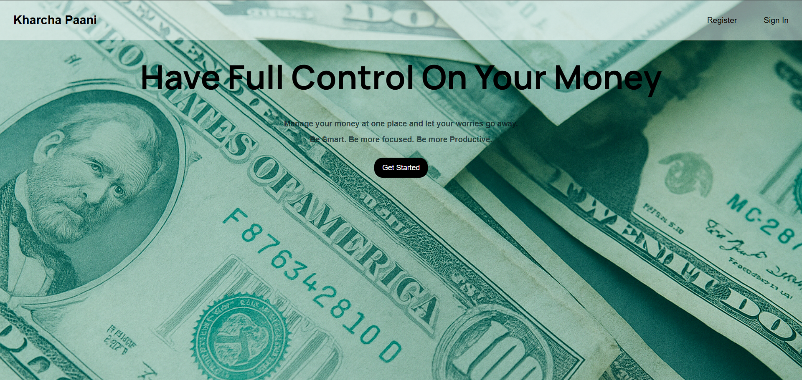
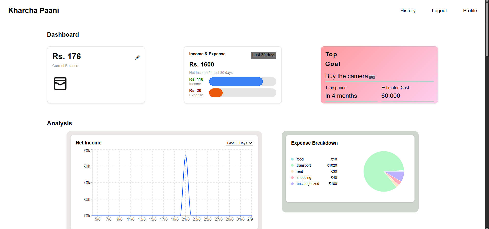
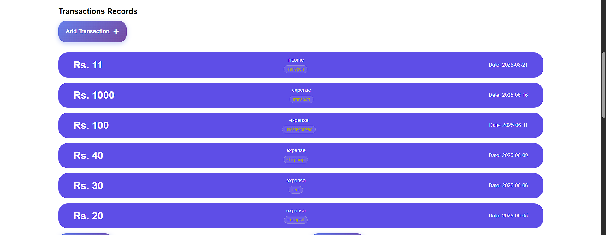
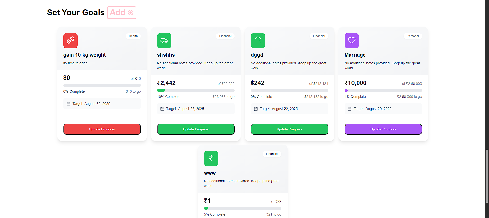

# 💰 Money Management App

A comprehensive personal finance management application built with React and Node.js.



---

## 🌟 **Key Highlights**

✨ **Modern UI/UX** - Clean, responsive design with intuitive navigation  
📱 **Mobile Friendly** - Works seamlessly across all devices  
🔒 **Secure Authentication** - JWT-based login with encrypted passwords  
📈 **Real-time Analytics** - Interactive charts and financial insights  
🎯 **Goal Tracking** - Set and monitor your financial objectives  
💾 **Data Persistence** - All your financial data securely stored

## 🚀 Features

### 📊 **Dashboard Overview**
- Real-time balance tracking
- Income and expense visualization
- Quick transaction overview
- Goal progress monitoring

### 💳 **Transaction Management**
- Add income and expense records
- Categorize transactions
- Transaction history with filtering
- Mark transactions as completed

### 🎯 **Goal Setting**
- Set and track financial goals
- Top goal prioritization
- Goal progress visualization
- Time-based goal planning

### 👤 **Profile Management**
- Account summary with financial statistics
- Editable profile information
- User preferences and settings

### 📈 **Analytics & Reports**
- Interactive charts and graphs
- 30-day financial trends
- Income vs expense breakdown
- Net income tracking

### 📧 **Smart Features**
- Email scheduling for reminders
- Transaction notifications
- Goal achievement alerts

## 🛠️ Tech Stack

### Frontend
- **React** - UI framework
- **CSS3** - Styling with custom CSS and modules
- **Axios** - HTTP client for API requests
- **Chart.js** - Data visualization
- **Vite** - Build tool and development server

### Backend
- **Node.js** - Runtime environment
- **Express.js** - Web framework
- **MongoDB** - Database
- **Mongoose** - ODM for MongoDB
- **JWT** - Authentication
- **bcrypt** - Password hashing
- **Nodemailer** - Email functionality

## 📁 Project Structure

```
my-money-app/
├── frontend/
│   ├── src/
│   │   ├── components/     # React components
│   │   ├── assets/        # Images and static files
│   │   └── styles/        # CSS modules
│   └── public/            # Public assets
└── backend/
    ├── Models/            # Database models
    ├── Routes/            # API routes
    ├── Middlewares/       # Custom middleware
    └── Services/          # Business logic
```

## 🚀 Getting Started

### Prerequisites
- Node.js (v14 or higher)
- MongoDB
- npm or yarn

### Installation

1. **Clone the repository**
   ```bash
   git clone <repository-url>
   cd my-money-app
   ```

2. **Install backend dependencies**
   ```bash
   cd backend
   npm install
   ```

3. **Install frontend dependencies**
   ```bash
   cd ../frontend
   npm install
   ```

4. **Set up environment variables**
   Create a `.env` file in the backend directory:
   ```env
   JWT_SECRET=your_jwt_secret
   MONGODB_URI=your_mongodb_connection_string
   EMAIL_ID=your_email@gmail.com
   EMAIL_PASS=your_app_password
   ```

5. **Start the development servers**
   
   Backend:
   ```bash
   cd backend
   npm start
   ```
   
   Frontend:
   ```bash
   cd frontend
   npm run dev
   ```

## 📱 Usage

1. **Register/Login** - Create an account or sign in
2. **Set up your profile** - Add personal information and preferences
3. **Add transactions** - Record your income and expenses
4. **Set goals** - Define your financial objectives
5. **Track progress** - Monitor your financial health through the dashboard
6. **Analyze trends** - Use charts to understand your spending patterns

## 🎨 Screenshots

### 🏠 Home Dashboard


*Clean and intuitive home dashboard with balance overview and quick actions*

### 📊 Main Dashboard


*Comprehensive dashboard showing financial overview, charts, and transaction summaries*

### 💳 Transactions Management


*Transaction history with filtering, categorization, and detailed records*

### 🎯 Goals & Planning


*Goal setting and tracking interface with progress visualization*

---

## 🔥 **Feature Overview**

| Feature | Description | Screenshot |
|---------|-------------|------------|
| 🏠 **Home Dashboard** | Quick overview with balance and shortcuts | [View](./src/assets/home-page.png) |
| 📊 **Analytics** | Detailed charts and financial insights | [View](./src/assets/first-page.png) |
| 💳 **Transactions** | Complete transaction management system | [View](./src/assets/transactions.png) |
| 🎯 **Goals** | Set, track, and achieve financial goals | [View](./src/assets/goal-sec.png) |

### 🎮 **Interactive Demo**
Experience the app's key features:
1. **Dashboard** → Real-time balance and transaction overview
2. **Transactions** → Add, edit, and categorize your financial records  
3. **Goals** → Set targets and track your progress
4. **Analytics** → Visualize your spending patterns and trends

## 🤝 Contributing

1. Fork the project
2. Create your feature branch (`git checkout -b feature/AmazingFeature`)
3. Commit your changes (`git commit -m 'Add some AmazingFeature'`)
4. Push to the branch (`git push origin feature/AmazingFeature`)
5. Open a Pull Request

## 📝 License

This project is licensed under the MIT License - see the [LICENSE](LICENSE) file for details.

## 👨‍💻 Author

**Abhra** - *Full Stack Developer*

---

⭐ **Star this repo if you find it helpful!**